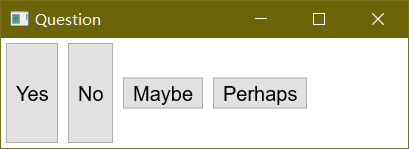

# Box元素定位

迄今为止, 我们知道怎么在一个box里面将元素进行水平或垂直定位。我们通常需要在box内对元素的定位和尺寸进行更多的控制。为此，我们首先需要知道一个box是怎么工作的。

一个元素的定位由他所属容器的布局样式决定。例如，在水平box中的一个按钮在前面的按钮的右边。一个元素的尺寸由两个因素决定：元素期望的大小和用户指定的大小。元素期望的大小由该元素所包含的内容决定。例如，一个按钮的宽度由按钮上所显示文本的长度决定。

一般来说元素的大小仅够容纳它的内容。一些元素，像文本输入框会使用一个默认的尺寸。box会分配足够的尺寸去将元素放在它里面。一个包括三个按钮的水平box将会包含比三个按钮更多的宽度，插入一些填充。


在图片中，开始两个按钮为它们的文本提供了合适的尺寸。第三个按钮比较长因为它包含更多的内容。box的宽度包含按钮间的填充空间和按钮的宽度总和。按钮的高度采用能够放置它的文本的合适尺寸。


## 宽度和高度属性

在窗口中你可能需要对元素的尺寸进行更多的控制。有更多的特性允许你去控制元素的尺寸。有一个快捷的方法可以通过在元素中简单添加width 和 height 属性，更像你在HTML中的 img 标签的用法。下面展示了一个栗子：


## 例 1

 - [源代码](./source/ex_boxstyle_1.xul)


```xml
<button label="OK" width="100" height="40"/>
```
然而，不推荐这样做。这么做适用性不好且可能与某些主题不匹配。一个更好的方法是使用样式表属性，它可以像中HTML中的样式表一样工作。可以使用下面的CSS属性。

 - `width`: 指定元素的宽度。
 - `height`: 指定元素的高度。

随便设置这两属性中的一个，元素将会创建它的宽度和高度。如果你只指定一个尺寸属性，另一个需要被算出。这些样式表属性的尺寸可以指定一个数字后面跟着一个单位。


## 可伸缩元素

非伸缩元素可以很简单快捷地计算尺寸。它们的宽度和高度可以直接被指定，如果没有指定尺寸，元素的默认尺寸就是刚好能放下它的内容的大小。对于可伸缩元素，计算需要一点窍门。

可伸缩元素有一个可以设置为大于0的属性`flex`。被用来设置在可伸缩性元素中可以扩展和收缩的有用填充空间。它们的默认尺寸可以像非伸缩元素一样被计算。下面的栗子做了这个的演示：

## 例 2 

 - [源代码](./source/ex_boxstyle_2.xul)


```xml
<window orient="horizontal"
        xmlns="http://www.mozilla.org/keymaster/gatekeeper/there.is.only.xul">

<hbox>
  <button label="Yes" flex="1"/>
  <button label="No"/>
  <button label="I really don't know one way or the other"/>
</hbox>

</window>
```
这个窗口会像之前的图片所显示的一样。前面两个按钮将一个合适尺寸作为默认宽度，第三个按钮将会比较大因为它有一个较长的标签。第一个按钮被建成是可伸缩的，并且将所有的三元素放在一个box里面。box的宽度被设置成全部三个元素的总宽度（图片的宽度大约是430像素）。

如果你增加窗口的宽度，元素会被检查清楚它们是否是可伸缩的，然后被分配到填充的空白空间。按钮只是可伸缩元素，但它不会增加宽度。这是因为按钮所在的box不是可伸缩的。一个非伸缩元素在空间有效时也不会改变尺寸，所以按钮不会比其他情况下变得更宽。因此，按钮不会变得更宽。

这个解决方案也用于创建可伸缩性的box。于是，当你创建一个更宽的窗口时，因此box会伸长以便填充多余的空间。因为box比较大，更多的空余空间可以被放在它里面，放在它里面的可伸缩按钮可以填充有效空间而得到扩展。这会被许多内嵌的box重复处理。


# Packing对齐

现有一个box拥有两个子元素，这两个子元素不能伸缩，但是这个box可以。具体如下：

## 例 3

 - [源代码](./source/ex_boxstyle_3.xul)


```xml
<box flex="1">
  <button label="Happy"/>
  <button label="Sad"/>
</box>
```

如果调整窗口大小，box本身可以伸缩所以可以适配窗口大小。但是[按钮](./button.md)不能伸缩，所以大小位置并没有变化。而box多出来空间则在窗口右侧显示。现在我们想让多出来的空间在左侧显示，让[按钮](./button.md)右对齐。

当然方法不只一种，可以在前面添加 [spacer](./spacer.md) 用来占位也是极吼(好)的。不过更好的解决方案是使用 [box](./box.md) 的 `pack` 属性。这个属性就是指定与**布局方向一致**的对齐方法——hbox就是水平对齐，vbox就是垂直对齐。可以是下列值：

 - `start` hbox(默认)就是左对齐 vbox(默认)就是上对齐
 - `center` 居中对齐
 - `end` hbox(默认)就是右对齐 vbox(默认)就是下对齐

`pack` 属性是针对容器的，而不是对希望对齐的元素本身设置该属性。

现在让这个栗子居中对齐：

## 例 4

 - [源代码](./source/ex_boxstyle_4.xul)


```xml
<box flex="1" pack="center">
  <button label="Happy"/>
  <button label="Sad"/>
</box>
```

到此，这个栗子应该会随着窗口大小的修改，始终居中对齐了。请简单比较一下这两个栗子的区别。

# Alignment对齐

上面这个 Happy-Sad 栗子是随着窗口的**宽度**改变而对齐变化的，如果仅仅增加窗口的高度，可以看出这个[按钮](./button.md)会变"高"。这是因为box会默认会在垂直于布局方向(另外一个方向)上伸缩。

你可以通过 `align` 属性修改这一默认行为。box会修改排列垂直于布局方向布局行为——hbox会修改垂直对齐行为，vbox会修改水平对齐行为。这一属性和 `pack` 类似：

 - `start` hbox上对齐，vbox左对齐
 - `center` 居中对齐
 - `end` hbox下对齐，vbox右对齐
 - `baseline` 基线对齐，仅仅适用于hbox
 - `stretch` 默认值，会在垂直布局方向


同 `pack`， `align` 属性是针对容器的，而不是对希望对齐的元素本身设置该属性。

下面这个栗子第1个box会默认拉伸子元素，而第2个box会让子元素垂直居中对齐：


## 例 5

 - [源代码](./source/ex_boxstyle_5.xul)



```xml
<?xml version="1.0"?>
<?xml-stylesheet href="chrome://global/skin/" type="text/css"?>

<window id="yesno" title="Question" orient="horizontal"
        xmlns="http://www.mozilla.org/keymaster/gatekeeper/there.is.only.xul">

  <hbox>
    <button label="Yes"/>
    <button label="No"/>
  </hbox>
  <hbox align="center">
    <button label="Maybe"/>
    <button label="Perhaps"/>
  </hbox>

</window>
```

同样可以使用样式表的 `-moz-box-pack` 以及 `-moz-box-align` 设置该属性

# REF

 - [XUL-Element_Positioning](https://developer.mozilla.org/en-US/docs/Mozilla/Tech/XUL/Tutorial/Element_Positioning)
