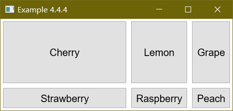
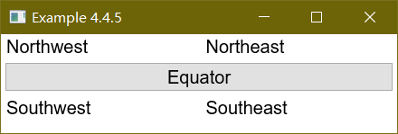

XUL有一系列的元素来创建表格布局

#  XUL的表格布局

使用[grid](./grid.md)元素可以在XUL中使用一系列的元素来进行元素的布局。这与HTML中的`table`有很大的相似性。网格本身不会有任何的显示，它仅仅是使用行和列的形式来定位其他元素。

一个网格内部的元素排列成行。在[grid](./grid.md)里面，你需要声明两种东西，[columns](./columns.md)和[rows](./rows.md)。正如HTML的`table`，你可以将[label](./label.md)和[button](./button.md)等内容放在[row](./row.md)里面。但是，[grid](./grid.md)只支持单独的[row](./row.md)或者单独的[column](./column.md)，因此你可以将内容放在[rows](./rows.md)里面或者columns里面。通常是使用[rows](./rows.md)。但是在[grid](./grid.md)中你还是可以使用[column](./column.md)并制定其大小和显示方式。或者你可以将内容放在[columns](./columns.md)里面，然后用[row](./row.md)来指定其显示方式。首先看看以[row](./row.md)的方式组织元素的方法。


## 声明一个网格

使用`rows`标签来声明一系列的`row`。`rows`必须是`grid`的子元素。在`rows`里面你可以添加`row`元素，`row`用在每一行。在`row`元素中你可以放任何你想要的内容在里面。

相似的，列由`columns`来声明。其中有单独的`column`元素，每个你想添加的列都是一个`column`元素。

用一个例子更容易理解。。

 - Example 1
 - [源代码](./source/ex_grids_1.xul)


```xml
<grid flex="1">
  
  <columns>
    <column flex="2"/>
    <column flex="1"/>
  </columns>

  <rows>
    <row>
      <button label="Rabbit"/>
      <button label="Elephant"/>
    </row>
    <row>
      <button label="Koala"/>
      <button label="Gorilla"/>
    </row>
  </rows>

</grid>
```

添加了一个两行两列的`grid`。每个列由一个`column`标签声明。每一列都设置了`flex`属性。每行航油两个元素都是半年。每个单元格不需要进行声明，可以直接将内容放在`row`元素里面。

## 带有更多元素的网格

你可以使用任何元素来代替上面的[button](./button.md)元素，。如果你想要一个详细的关于容纳多个元素的单元，你可以使用嵌套的[hbox](./hbox.md)或者其他`box`元素。一个`hbox`元素是一个单一的元素，但是你可以在里面放任意多的元素。例如：

 - Example 2
 - [源代码](./source/ex_grids_2.xul)


```xml
<grid flex="1">

  <columns>
    <column/>
    <column flex="1"/>
  </columns>

  <rows>
    <row>
      <label control="doctitle" value="Document Title:"/>
      <textbox id="doctitle" flex="1"/>
    </row>
    <row>
      <label control="docpath" value="Path:"/>
      <hbox flex="1">
        <textbox id="docpath" flex="1"/>
        <button label="Browse..."/>
      </hbox>   
    </row>
  </rows>

</grid>
```

注意第二列的第二行，含有一个`box`，`box`里面有一个文本框和一个按钮。你可以添加嵌套的`box`或者在里面放置另外一个`grid`。

由于第二行和文本框都设置了`flex`属性，所以改变窗口尺寸的时候文本框会改变大小，而其他元素不会改变。

一列的宽度由该列中最宽的元素决定。同牙膏的一行的高度由这一行中最高的元素决定。你可以使用`minwidth`和`maxwidth`以及相关的属性来对尺寸作更多的定义。


## 按列组织

你也可以在列中添加元素，这样一来，row元素就只是用来表示有多少行了。

 - Example 3
 - [源代码](./source/ex_grids_3.xul)


```xml
<grid>
  <rows>
    <row/>
    <row/>
    <row/>
  </rows>

  <columns>
    <column>
      <label control="first" value="First Name:"/>
      <label control="middle" value="Middle Name:"/>
      <label control="last" value="Last Name:"/>
    </column>
    <column>
      <textbox id="first"/>
      <textbox id="middle"/>
      <textbox id="last"/>
    </column>
  </columns>

</grid>
```

这个网格有三行两列。元素`row`仅仅表示有多少行。你可以添加`flex`属性来使其自适应。内容在每一列中。

如果你在列和行中都填内容，内容将会相互覆盖，不过他们会在`grid`中合适的进行排列。就像在网格中有堆元素一样。

`Grid`中元素的顺序决定了哪一个会显示在上面，哪一个在下面。如果`rows`元素放在`columns`元素后面，在`rows`中的内容会显示在上面。如果`columns`放在`rows`元素后面，列中的内容会显示在上面。事件的获取也一样。。


## 网格自适应

网格的一个优点是在一系列嵌套`box`中你可以创建在水平和竖直方向上都自适应的单元格。你可以通过使用`flex`属性在`row`和`column`元素上来实现。下面的例子说明了这一点：

 - Example 4
 - [源代码](./source/ex_grids_4.xul)




```xml
<grid flex="1">
 <columns>
  <column flex="5"/>
  <column/>
  <column/>
 </columns>
 <rows>
  <row flex="10">
    <button label="Cherry"/>
    <button label="Lemon"/>
    <button label="Grape"/>
  </row>
  <row flex="1">
    <button label="Strawberry"/>
    <button label="Raspberry"/>
    <button label="Peach"/>
  </row>
 </rows>
</grid>
```

第一列和所有两行都设置为自适应。这样的结果是第一列中的单元格在水平方向上自适应，另外每个单元格都会在竖直方向上自适应，因为两行都是自适应的，不过第一行还不止这样。第一列和第一行的单元格将会在水平方向上以5的倍率伸缩，在竖直方向上以10的倍率伸缩。

元素`grid`也要设置`flex`属性，这样所有的网格才能自适应，否则就只会在一个方向上自适应。

# 列宽扩展

让很多行和列中的一个单元格扩展是没有意义的。但是可以让一行或者一列整个的扩展。为了实现这一点只需要在`rows`元素中添加一个元素。比如可以使用一个`box`样式。让回将其他元素放在里面。下面是一个简单的例子：


 - Example 5
 - [源代码](./source/ex_grids_5.xul)



```xml
<grid>
  <columns>
    <column flex="1"/>
    <column flex="1"/>
  </columns>

  <rows>
    <row>
      <label value="Northwest"/>
      <label value="Northeast"/>
    </row>
    <button label="Equator"/>
    <row>
      <label value="Southwest"/>
      <label value="Southeast"/>
    </row>
  </rows>
</grid>
```

按钮将会扩展以适合整个`grid`的宽度，因为它不是一个`grid`的行中的元素。你也可以将相似的方式用在两个列中。这样就会扩展以一与网格的高度相适应。你可以在行和列上都使用，如果你想这样做。

# REF
 
 - [XUL-Grids](https://developer.mozilla.org/en-US/docs/Archive/Mozilla/XUL/Tutorial/Grids)

