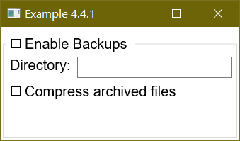

# Groupboxes

The [groupbox](./groupbox.md) element is used to group related XUL elements together, much like the HTML `fieldset` element is used to group HTML elements. The [groupbox](./groupbox.md) is a type of box, and the elements it contains are aligned according to the XUL box rules. However, there are several differences between groupboxes and regular boxes:

 - The groupbox can be labeled using the [caption](./caption.md) element.
 - The groupbox is displayed in a special way—usually with a beveled border and a caption, although you can change the appearance using CSS.

 You can create a caption for your [groupbox](./groupbox.md) by inserting a [caption](./caption.md) element as the first child. Groupboxes are box elements, so you can use the box attributes, such as orient and flex.

## A simple groupbox example

The example below shows a simple groupbox:

 - Example 1 
 - [Source](./source/ex_titledbox_1.xul)

 


```xml
<groupbox>
  <caption label="Answer"/>
  <label value="Banana"/>
  <label value="Tangerine"/>
  <label value="Phone Booth"/>
  <label value="Kiwi"/>
</groupbox>
```

This will cause four pieces of text to be displayed surrounded by a box with the label Answer. Note that the groupbox has a vertical orientation by default which is necessary to have the text elements stack in a single column.


## More complex captions

You can also add child elements inside the [caption](./caption.md) element to create a more complex caption. For example, Mozilla's Font preferences panel uses a drop-down menu as a caption. Although any content can be used, usually you would use a checkbox or dropdown menu.

 - Example 2 
 - [Source](./source/ex_titledbox_2.xul)



```xml
<groupbox flex="1">
  <caption>
    <checkbox label="Enable Backups"/>
  </caption>
  <hbox>
    <label control="dir" value="Directory:"/>
    <textbox id="dir" flex="1"/>
  </hbox>
  <checkbox label="Compress archived files"/>
</groupbox>
```

In this example, a [checkbox](./checkbox.md) has been used as a caption. We might use a script to enable and disable the contents of the groupbox when the [checkbox](./checkbox.md) is checked and unchecked. The groupbox contains a horizontal [box](./box.md) with a [label](./label.md) and [textbox](./textbox.md). Both the textbox and groupbox have been made flexible so the textbox expands when the window is expanded. The additional checkbox appears below the textbox because of the vertical orientation of the groupbox. We'll add a groupbox to the find files dialog in the next section.


# Radio Groups

You can use the [radiogroup](./radiogroup.md) element to group radio elements together. The [radiogroup](./radiogroup.md) is a type of box. You can put any element you want inside it, and apart from its special handling of [radio](./radio.md) buttons, it works like any other box.

Any radio buttons placed inside the radio group will be grouped together, even if they are inside nested boxes. This could be used to add extra elements within the structure, such as in the following example:

 - Example 3
 - [Source](./source/ex_titledbox_3.xul)


```xml
<radiogroup>
  <radio id="no" value="no" label="No Number"/>
  <radio id="random" value="random" label="Random Number"/>
  <hbox>
    <radio id="specify" value="specify" label="Specify Number:"/>
    <textbox id="specificnumber"/>
  </hbox>
</radiogroup>
```

Note that the [radiogroup](./radiogroup.md) element does not draw a border around it. You should place a [groupbox](./groupbox.md) element around it if a border and caption are desired.

# REF

 - [XUL-Groupboxes](https://developer.mozilla.org/en-US/docs/Archive/Mozilla/XUL/Tutorial/Groupboxes)
