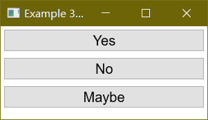
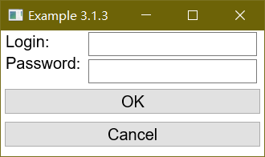

# The Box Model

## Introduction to Boxes

The main form of layout in XUL is called the 'Box Model'. This model allows you to divide a window into a series of boxes. Elements inside of a box will [orient](#orient) themselves horizontally or vertically. By combining a series of boxes, spacers and elements with [flex](#flex) and [pack](#pack) attributes, you can control the layout of a window.

Although a box is the fundamental part of XUL element layout, it follows a few very simple rules. A box can lay out its children in one of two orientations, either horizontally or vertically. A horizontal box lines up its elements horizontally and a vertical box orients its elements vertically. You can think of a box as one row or one column from an HTML table. Various attributes placed on the child elements in addition to some CSS style properties control the exact position and size of the children.

### Box elements

 The basic syntax of a box is as follows:

```xml
<hbox>
  <!-- horizontal elements -->
</hbox>

<vbox>
  <!-- vertical elements -->
</vbox>
```

The [hbox](./hbox.md) element is used to create a horizontally oriented box. Each element placed in the hbox will be placed horizontally in a row. The [vbox](./vbox.md) element is used to create a vertically oriented box. Added elements will be placed underneath each other in a column.

There is also a generic box element which defaults to horizontal orientation, meaning that it is equivalent to the [hbox](./hbox.md). However, you can use the [orient](#orient) attribute to control the orientation of the box. You can set this attribute to the value `horizontal` to create a horizontal box and vertical to create a `vertical` box.

Thus, the two lines below are equivalent:

```xml
<vbox></vbox>

<box orient="vertical"></box>
```

The following example shows how to place three buttons vertically.

### Example 1 

 - [Source](./source/ex_boxes_1.xul)



```xml
<vbox>
  <button id="yes" label="Yes"/>
  <button id="no" label="No"/>
  <button id="maybe" label="Maybe"/>
</vbox>
```

The three buttons here are oriented vertically as was indicated by the box. To change the buttons so that they are oriented horizontally, all you need to do is change the [vbox](./vbox.md) element to a [hbox](./hbox.md) element.

### Login prompt example

You can add as many elements as you want inside a box, including other boxes. In the case of a horizontal box, each additional element will be placed to the right of the previous one. The elements will not wrap at all so the more elements you add, the wider the window will be. Similarly, each element added to a vertical box will be placed underneath the previous one. The example below shows a simple login prompt:

### Example 2

 - [Source](./source/ex_boxes_2.xul)


```xml
<vbox>
  <hbox>
    <label control="login" value="Login:"/>
    <textbox id="login"/>
  </hbox>
  <hbox>
    <label control="pass" value="Password:"/>
    <textbox id="pass"/>
  </hbox>
  <button id="ok" label="OK"/>
  <button id="cancel" label="Cancel"/>
</vbox>
```

Here four elements have been oriented vertically, two inner [hbox](./hbox.md) tags and two [button](./button.md) elements. Notice that only the elements that are direct descendants of the box are oriented vertically. The labels and textboxes are inside the inner `hbox` elements, so they are oriented according to those boxes, which are horizontal. You can see in the image that each label and textbox is oriented horizontally.

### Aligning textboxes

If you look closely at the image of the login dialog, you can see that the two textboxes are not aligned with each other horizontally. It would probably be better if they were. In order to do this we need to add some additional boxes.

### Example 3

 - [Source](./source/ex_boxes_3.xul)



```xml
<vbox>
  <hbox>
    <vbox>
      <label control="login" value="Login:"/>
      <label control="pass" value="Password:"/>
    </vbox>
    <vbox>
      <textbox id="login"/>
      <textbox id="pass"/>
    </vbox>
  </hbox>
  <button id="ok" label="OK"/>
  <button id="cancel" label="Cancel"/>
</vbox>
```

Notice how the text boxes are now aligned with each other. To do this, we needed to add boxes inside of the main box. The two labels and textboxes are all placed inside a horizontal box. Then, the labels are placed inside another box, this time a vertical one, as are the textboxes. This inner box is what makes the elements orient vertically. The horizontal box is needed as we want the labels vbox and the inputs vbox to be placed horizontally with each other. If this box was removed, both textboxes would appear below both of the labels.

The issue now is that the 'Password' label is too high. We should really use the [grid](./grid.md) element here to fix this which we'll learn about in a later section.